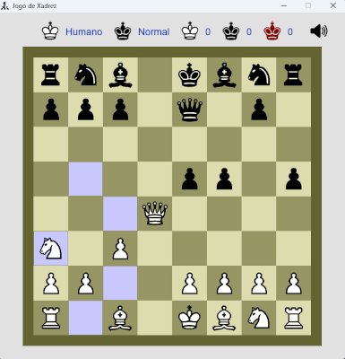

# Italo Xadrez

Veja abaixo uma captura de tela do jogo em execução:



Este jogo de xadrez foi construído em C++. 


Atenção: essas versões do sistema foram compiladas em arquitetura "x86_64". Não foi criada ainda versão para arquitetura "i686".

## Executando no windows

Para executar no windows, basta baixar o instalador na release mais recente do repositório. O instalador tem o nome: "italo-xadrez-x.x-win32.exe", onde o x.x é a versão do projeto. 

Para executar no windows sem instalador, basta baixar a versão zipada para windows na release mais recente do repositório e descompactar e executar o arquivo "italo-xadrez.exe". Por exemplo, o arquivo zipado deve ter o nome: "italo-xadrez-x.x-win32.zip" onde o x.x é a versão do projeto.

## Executando no linux

Para executar em alguma distribuição linux, basta baixar o arquivo de nome: "italo-xadrez-x.x.tar.gz" na release mais recente do repositório e descompactar e executar o script "italo-xadrez". Exemplo;

```
tar -xvf italo-xadrez-2.2.tar.gz
cd italo-xadrez-2.2
./italo-xadrez
```

## Estrutura do projeto

<ul>
	<li>Os arquivos cabeçalhos (.h) e fonte (.cpp) estão na pasta "src".</li>
	<li>Na pasta "assets" é onde estão os recursos necessários para o jogo funcionar como: arquivos de audio, imagem e fonte.</li>
	<li>As bibliotecas estáticas e dinâmicas necessárias para o jogo ser linkado no windows estão na pasta "lib".</li>
    <li>Na pasta "include", estão os arquivos ".h" de cabeçalho do SDL2, necessários para compilar o projeto no windows.</li>
    <li>Na pasta "glibc-2.39" está o glibc-2.39 compilado no linux. O glibc é necessário para o sistema 
    funcionar em qualquer linux.</li>
    <li>O "cbuild.exe" e "cbuild" são programas, para windows e linux, que criei e que podem ser utilizados no processo de build. Isto é, compilar, linkar e outras tarefas.</li>
    <li>Os scripts "buildapp.sh" e "buildapp.bat" podem ser utilizados para executar o cbuild e outros comandos para buildar e empacotar o sistema.</li>
    <li>Os script "install-deps.sh" pode ser utilizado para instalar, ou remover, o SDL2 no linux ubuntu.</li>
    <li>O arquivo "italo-xadrez" é o script que executa a aplicação no linux. Ele será copiado para pasta de build do projeto.</li>
    <li>O script "gen_resource.bat" gera o arquivo de recurso de icone "icon.rc" para ser embutido no executável da aplicação no windows.</li>
</ul>
				
## Compilando e executando o build no linux?

Para compilar, linkar e copiar as dependências para uma pasta "libs", é necessário 
instalar o SDL2, versão de desenvolvimento, no seu sistema operacional linux. Se estiver 
no ubuntu, pode executar os seguintes comandos:

```
sudo apt -y install libsdl2-dev
sudo apt -y install libsdl2-mixer-dev
sudo apt -y install libsdl2-image-dev
sudo apt -y install libsdl2-ttf-dev
```

Ou executar o seguinte script:

```
./install-deps install dev
```

Feito isto, com o SDL2, o SDL2 mixer, o SDL2 image e o SDL2-ttf instalados, basta 
executar o seguinte script na raiz do projeto:

```
./buildapp.sh
```

Esse script utiliza um programa que criei: o "cbuild", que pode ser utilizado 
para build automático de aplicações C/C++.

Agora, o software está na basta "build/italo-xadrez-x.x", onde o "x.x" é a versão do projeto. Para executar o programa, basta entrar nessa pasta e executar como a seguir:

```
cd build/italo-xadrez-2.2
./italo-xadrez
```

Esse exemplo é para o caso da versão ser a "2.2"!

# Compilando e linkando no windows

Para compilar no windows, você pode utilizar o MinGW, arquitetura x86_64. 

Além do mingw, o projeto depende das bibliotecas: SDL2, SDL2_ttf, SDL2_mixer, SDL2_image. Essas bibliotecas (para compilar e linkar no windows) estão nas pastas "include" e "lib". Então vamos lá:

Se quiser desenvolver alguma aplicação em SDL2 com suporte a imagens, audio e fontes de texto, pode entrar no site: https://libsdl.org/ e baixar as seguintes bibliotecas:

```
	SDL2-2.32.8, 
	SDL2_mixer-2.8.1, 
	SDL2_image-2.8.8,
    SDL2_ttf
```

Os arquivos necessários dessas bibliotecas já estão inclusos no projeto nas pastas "include" e 
"lib".
		
Agora é só compilar, linkar e concluír o build utilizando o cbuild. Então execute o seguinte comando:

```
.\cbuild.exe buildall --settings-file=settings-windows.txt
```

Ou execute o script conforme a seguir:

```
.\buildapp.bat
```

Se tudo correr bem, o projeto linkado e os arquivos necessários para ele funcionar deverão ser 
copiados para pasta: "build/italo-xadrez-x.x-win32", onde x.x é a versão do projeto.

Para executar, é só entrar na pasta "build/italo-xadrez-x.x-win32" e executar o programa "italo-xadrez.exe"